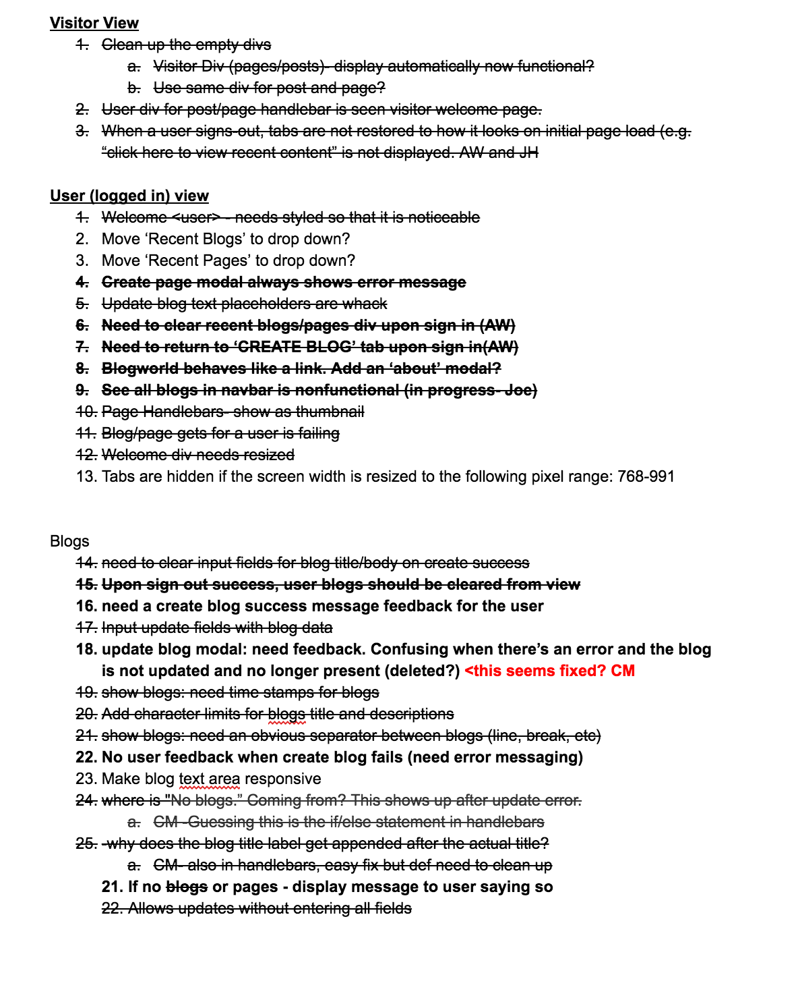
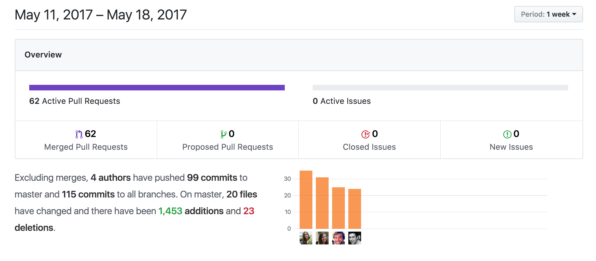
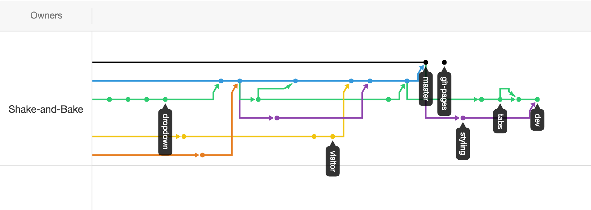
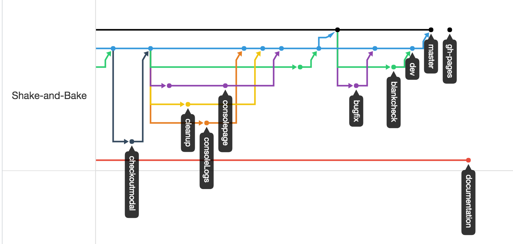

[](https://generalassemb.ly/education/web-development-immersive)

# FEATHERPEN Client Documentation

FEATHERPEN is a blog site created by Team Shake-N-Bake for General Assembly's WDI Team Project component.
Users can create blogs and pages, view blogs and pages submitted by other users, and update or delete their own content.
[Link to Deployed Application](https://shake-and-bake.github.io/cms-client/)

# Planning

## Stories
1. As a user I want to be able to sign-up for the application.
1. As a user I want to be able to sign-in so I can use the application.
1. As a user I want to be able to change my password so I can update my credentials if needed.
1. As a user I want to be able to sign-out so I can exit my session of the application.
1. As a visitor I want to be able to view the content without signing in.
1. As a user I want to see a dashboard after logging in.
1. As a user I want to be able to create new blog posts
1. As a user I want to be able to update my blog posts
1. As a user I want to be able to delete my blog posts
1. As a user I want to be able to view my blog posts.
1. As a user I want to be able to create new pages.
1. As a user I want to be able to update my page.
1. As a user I want to be able to delete my pages.
1. As a user I want to be able to view my pages.

## ERD


# Management Approach

## Meetings and planning
We had 3 daily meetings, accumulating a max of 15 minutes of meetings per day.
- 2 daily standups (beginning of the day and at lunch)
- 1 retrospective per day (end of day)

We had a high level plan to keep us focused on getting to MVP and made daily checklists for the more granular tasks.


## Testing and Issue Management
 - Team members tested features locally after coding
 - Before submitting a pull request from feature branch to dev branch, the developer tested with a partner
 - Reviewed code as a team before approving pull request to dev
 - Spent time at end of everyday testing our most recently deployed code
 - [Documented bugs and issues](https://docs.google.com/document/d/1FoYQHw9GXsvsY8gV6JM2EhZloFez13ORwp24Nmo1J5w/edit?usp=sharing) as we found them

 

# Git

## How We Used Git and GitHub
- used `feature` branches to code various features
- merge `feature` to `dev` when features were completed
- merged from `dev` branch to `master` for deploys
- used GitHub reporting tools to review commit history by developer
- used GitHub to visualize branch management



## Git Process
- QA Lead owned the process
- Team branched from `master` to `dev` to `feature` branches
- When developers completed coding and testing their features use `git push origin <branch>`
- submit pull request from `feature` to `dev`
- review pull request with QA Lead, QA Lead approves, denies, or fixes merge conflict
- When merges to `dev` branch occur, the team does a `git pull origin dev` and then does a `git rebase dev` on `feature` branches
- When time to deploy, front-end and back-end leads submit pull requests from `dev` to `master`
- Entire team reviews code one last time
- QA Lead approves pull request




# Client Challenges and Accomplishments
- Adding handlebars helpers to show the 'Last Updated' field on the rendered list of blogs
```js
module.exports = function (createdAt) {
  const date = createdAt.split('T')[0]
  return date
}
```
- Adding handlebars helpers to allow user to select which template to apply to pages (Rachel)
```js
<!-- Example Template forms with styling -->
              <h2>Example Templates</h2>
                <div class='defaultTemplate col-md-4'>Default Template


                  <p>This is what your body what look like using the default template. </p>
                  <p>Footer</p>
                </div>
                <div class='coolTemplate col-md-4'>Cool Template


                  <p>This is what your body what look like using the cool template. </p>
                  <p>Footer</p>
                </div>
                <div class='fancyTemplate col-md-4'>Fancy Template


                  <p>This is what your body what look like using the fancy template. </p>
                  <p>Footer</p>
                </div>
```
- Styling; The application has come a long way since inception in the design and style of the app through bootstrap, handlebars and importing fonts (Chris).
- Thorough UX considerations brought many coding challenges; figured out how update the input fields inside modals generated by bootstrap even after a user types something then exits without submitting and then goes back in for update blog modal (Rachel).


## [License](LICENSE)

1.  All content is licensed under a CC­BY­NC­SA 4.0 license.
1.  All software code is licensed under GNU GPLv3. For commercial use or
    alternative licensing, please contact legal@ga.co.
